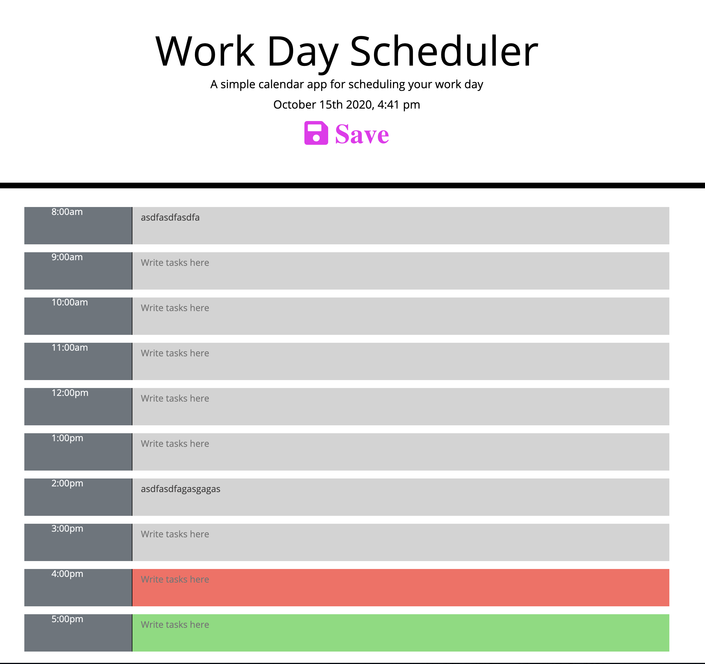

# Weather Widget

* homework 5 for U of U coding bootcamp

* Live Site: https://ajlaursen.github.io/ajlaursens-weather-widget/

* Repo: https://github.com/ajlaursen/ajlaursens-weather-widget

* created day scheduler.

* changed format from homework preview to be more modern

* uses local storage to save and recall events

* uses moment.js to retreive time data to show where in the day you are. 

* Technologies: HTML, Bootstrap, JS, Jquery, CSS

* Contact: Alex Laursen - Ajlaursen@aol.com
